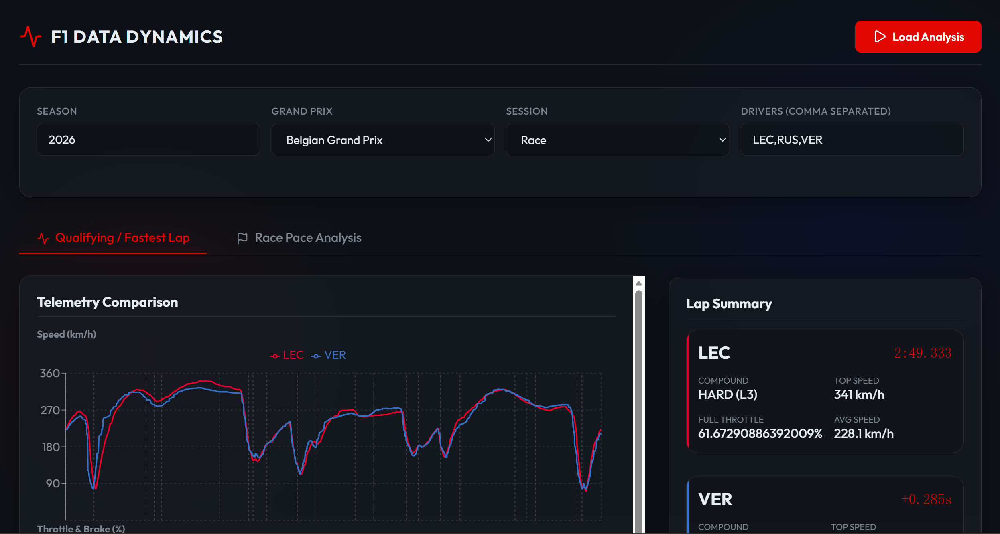

# F1 Data Dynamics (一级方程式赛车遥测与正赛长距离分析平台)

这是一个基于 **Python (FastAPI)** 与 **React (Vite)** 的现代化 F1 赛车数据分析与可视化 Web 应用程序。利用 FastF1 深度挖掘一级方程式赛车的遥测数据与正赛节奏，为赛车爱好者和数据分析师提供高颜值、交互式的复盘工具。

## 功能展示




## 核心功能

- 🏎️ **交互式单圈遥测对比 (Qualifying / Fastest Lap)**：
  - 在线的油门、刹车、速度三联图，支持动态 Hover 查看精细数值。
  - 自动标注赛道弯角编号与距离，直观对比不同车手在刹车点与加油点的表现差异。
  - 自动计算速度差及车手最快圈量化摘要（最高速度、平均速度、全油门比例等）。

- 🏁 **多圈正赛长距离节奏分析 (Race Pace Analysis)**：
  - 绘制整场比赛（或特定 Stint）圈速散点图，直观展现车手长跑节奏（Race Pace）与轮胎衰退曲线（Tyre Degradation）。
  - 自动去除进出站（In/Out Laps）及安全车（VSC/SC）等非正常圈速的干扰。

- 💎 **可视化交互界面**：
  - 采用前后端分离架构，配合深色模式（Dark Mode）与玻璃拟物化（Glassmorphism）视觉设计。
  - 灵活的参数设置：自由选择赛季年份、大奖赛分站、比赛阶段（Q/R/FP）及多车手对比。

## 技术栈

- **后端 (Backend)**: Python 3.10+, FastAPI, Uvicorn, FastF1, Pandas, NumPy
- **前端 (Frontend)**: React, Vite, Recharts, Lucide React, Vanilla CSS (Glassmorphism design tokens)
- **环境管理**: Python Virtual Environment (`.venv`), Node.js (npm)

## 项目结构

```text
├── backend/            # FastAPI 后端应用与 FastF1 分析引擎
│   ├── main.py         # RESTful API 入口
│   ├── f1_analysis.py  # 遥测数据提取与 Race Pace 逻辑
│   ├── cli.py          # 兼容原有的命令行脚本
│   └── requirements.txt# 后端依赖清单
├── frontend/           # Vite + React 前端应用
│   ├── src/
│   │   ├── components/ # 交互图表组件 (TelemetryChart, RacePaceChart)
│   │   ├── App.jsx     # 主仪表盘视图
│   │   └── index.css   # 全局 UI 样式与设计变量
│   └── package.json
└── f1_cache/           # FastF1 本地缓存目录
```

## 快速启动

### 1. 启动后端 API 服务

打开一个终端窗口，激活虚拟环境并运行 FastAPI 后端：

```powershell
# 进入后端目录（或在根目录激活环境）
.\.venv\Scripts\activate

# 安装后端依赖（若尚未安装）
pip install -r backend/requirements.txt

# 启动 API 服务
cd backend
python -m uvicorn main:app --host 0.0.0.0 --port 8000 --reload
```

_后端 API 文档可访问 [http://localhost:8000/docs](http://localhost:8000/docs)_

### 2. 启动前端 Web 界面

打开第二个终端窗口，启动 Vite 开发服务器：

```powershell
cd frontend

# 安装前端依赖（若尚未安装）
npm install

# 启动前端 App
npm run dev
```

在浏览器中打开 **[http://localhost:5173/](http://localhost:5173/)** 即可使用完整的 Web 分析平台

---

## 路线图 (Roadmap)

- [x] 增加弯角编号、制动点和油门恢复点标注
- [x] 增加轮胎、天气和赛道状态等可比性上下文
- [x] 增加交互式 Web 界面与多圈/长距离比赛分析

🏎️🏁💨
